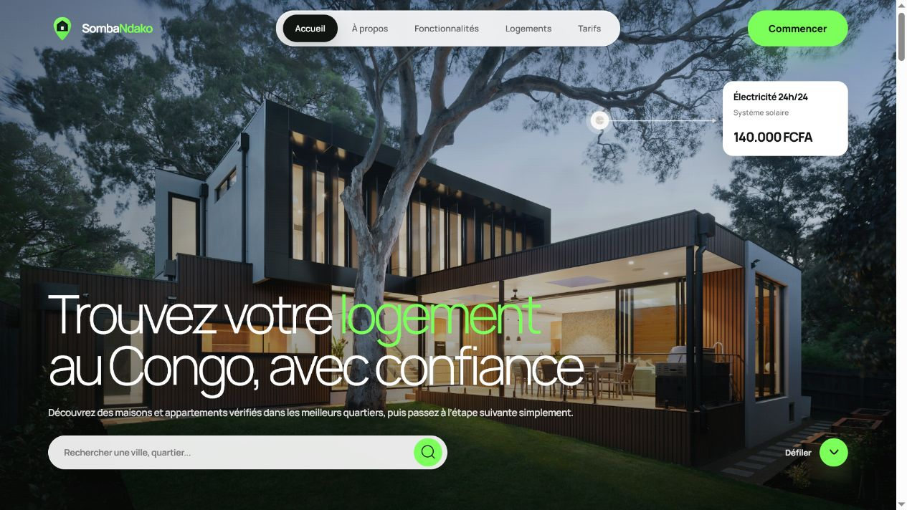

# Housing Landing Page

Landing page avancee realisee avec HTML5 et CSS vanilla pour presenter Somba Ndako, une plateforme de recherche de logements verifies au Congo.



## Demo

- GitHub Pages : https://osiris-balonga.github.io/housing-landing-page/
- Repository : https://github.com/Osiris-Balonga/housing-landing-page

## Objectif

Ce projet repond au livrable de landing page avancee demande dans la phase HTML/CSS/Git. La page met en avant une proposition de valeur claire, des logements, des fonctionnalites, des tarifs, des temoignages et un appel a l'action.

## Sections principales

- Hero avec recherche de logement
- Presentation du service
- Fonctionnalites
- Logements mis en avant
- Tarifs pour logeurs, proprietaires et agences
- Avis utilisateurs
- Newsletter et footer

## Technologies

- HTML5 semantique
- CSS3
- Variables CSS
- Images locales
- Meta tags Open Graph et X
- Favicon et manifest

## Structure

```text
housing-landing-page/
  images/
  index.html
  style.css
  README.md
```
